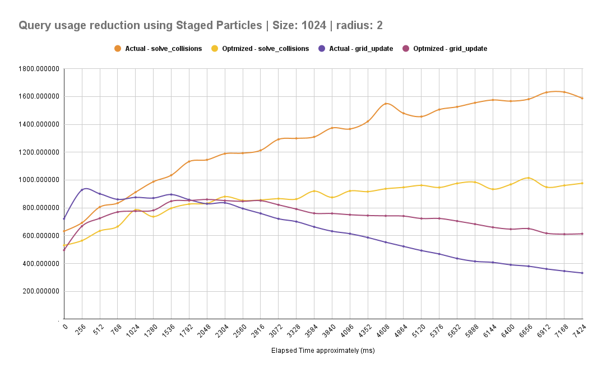

# Changelog | Devlog

### 0.10.0 - xx/01/2025 - [Planejamento]
> Adicionar cores as particulas baseado em [*Aceleração*,*Proximidade ao centro de força*, *Direção*, *Tempo de Vida*]

---
### 0.9.0 - xx/01/2025 - [Planejamento]
> Testar e validar substituição de coordenadas no solve collisions por flatmap de index
> Testar uso de bitwise no flatmap de index como alternativa para uso de módulo na checkagem de borda com index (computacionalmente custoso)

---
### 0.8.0 - xx/01/2025 - [Planejamento]
> Adicionar mais formatos de ambiente a simulação

---
### 0.7.0 - 12/01/2025
#### Adicionado
- Raio de particulas procedural a partir de seed (default 0)
- Parâmetro min_particle_radius as configurações da simulação

#### Alterado
- Refatoração do código de spawn para evitar realocação de memoria desnecessária
- Configurações da simulação

---
### 0.6.0 - 11/01/2025
> Com o uso de substeps, a simulação passou a testar colisão 8x ao longo de um fixed update, aumentando consideravelmente o peso das consultas com querys pelo bevy. Como atualmente tenho total controle de quantas entidades existem na simulação, alterei a forma como as queries funcionam, invés de consultá-las a cada iteração de substep dentro das chamadas de física, faço uma única consulta por fixed update, atribuo o resultado de Particle a um vec buffer, e uso ao longo dos substeps. Ao final, dos substeps, devolvo ao controle do ECS as partículas atualizadas contidas no buffer. Somado a isso, a estrutura do Grid foi simplificado, os dados dentro das células deixaram de indicar a referência das entidades que ali estão e passaram a atribuir apenas o index da consulta por Particle na simulação.

> Notasse no comparativo da otimização uma queda considerável no custo de tempo para iterar sobre a lógica de colisões (solve_collisions). Por outro lado houve um aumento no custo para atualizar as células do grid que divide os grupos de particulas (grid_update). Fato importante a considerar, atualmente o grid_update roda 64 vezes por segundo conforme a configuração de hz do fixed update, já o solve_collisions atualiza 8 vezes por iteração do fixed update, totalizando 512 vezes por segundo. No fim valeu muito a pena. Ao fim da simulação, o agregado por ciclo com total dos métodos foi de ~13kµs para ~8.4kµs, uma redução de ~35% do tempo gasto.

#### Alterado
- Migrado sistema de queries ECS das lógicas para buffer de Particle

---
### 0.5.3 - 10/01/2025
#### Alterado
- Diagnóstico de solve_collisions agora roda fora da função, a nível de substeps

---
### 0.5.2 - 10/01/2025
#### Alterado
- Diagnóstico gerado a cada 1000 -> 256 ms

---
### 0.5.1 - 10/01/2025
#### Adicionado
- Adicionado configuração de softening para suavizar o ponto de singularidade

#### Alterado
- Área de spawn levemente reduzida para evitar problema com colisão prematura com a borda
- Mudanças gerais na configuração da simulação para tornar mais estável

#### Removido
- Removido .max de lenght_squared ao ser puxado pela gravidade. (A adição de softening já previne divisão por zero e tem resultado melhor na suavização).

---
### 0.5.0 - 10/01/2025
> A maior das minhas questões com os substeps, "Faz sentido implementar substeps ou seria melhor apenas subir os hz do fixed update?", após muita pesquisa, entendi que no caso dessa simulação, a variar do futuro que pretendo chegar com ela, a solução de apenas aumentar os hz teria overhead no ECS tendo que fazer mais querys que o necessário, então uma solução seria sair dele, mas eu planejo seguir a abordagem gerenciada pelo bevy. A diferença não será tanta por agora, mas planejo subir uma otimização ainda na v0.5.x reduzindo o overhead criado por ambos os métodos, mas supostamente mais fácil para tratar com ECS e substeps. Será uma otimização legal que planejo medir e documentar, mas fica pra mim descobrir no futuro próximo.

> Sobre os testes de performance, tive um problema pra fazer uma das otimizações que eu queria por um fator, instabilidade da simulação. A otimização depende de algumas configurações especificas na simulação com valores multiplos de *x* valor, portanto, senti a necessidade de adiar essa etapa e partir para algo mais estável antes. Então essas otimizações devem dar frutos na v0.6 ou v0.7.

> Estava pensando aqui, o horario desses commits próximos podem levar a uma compreensão errada. Muitas das minhas mudanças são feitas em um momento e não ficam 100% da forma que eu gostaria de subir, então acabam se misturando com algumas outras implementações. Por fim eu tiro um tempo para reorganizar as mudanças, ideias e lógica de separação. Quando termino essa etapa fico com vários commits organizados para subir, daí vai junto, resumo, acabei tirando um pouco de cada dia nesse projeto, mas a lógica de subida dos commits acaba mascarando isso e condensando em um conjunto de commits com periodos próximos. O tempo que levo entendendo cada conceito antes de aplicá-lo também é consideravel, são muitos cálculos e fórmulas matemáticas que estou tendo contato pela primeira vez. (Imagino que seja esperado para alguém que não se formou em física hehe).

#### Adicionado
- Sistema de substeps
- Adicionado log ao git ignore

#### Alterado
- Alterado configuração da simulação para se adaptar com substeps
- Sistemas de física de movimento e colisão foram migrado para lógica interna
- **dt*dt** substituído por **dt** por substep
- Renomeado friction (global) para damping
- Renomeado collision_friction para restitution_amortization
- Alterado logfile

---
### 0.4.4 - 08/01/2025
> Enquanto faço meus diversos testes de performance, notei algo que estou fazendo "errado", minha precisão com posição e velocity(implícita) não estava me agradando, isso se deve ao fato de estar usando **dt*dt** para os cálculos de física, que não deve ser necessário usando fixed update.
Portanto planejo fazer uma migração para **dt** apenas, isso vai fazer grande mudança nas velocidades, então terei que reduzir alguns valores.
No fim vai aumentar bastante a precisão mesmo usando f32.
Particularmente, também planejo implementar um sistema de substeps, mas isso pode custar problemas de colisão com o grid.
Enfim, estou avaliando.

> Acontece que nesse PR subiram algumas mudanças menores de preparativo para a mudança maior, 'os substeps'. Sinceramente, eu já fiz alguns testes com ele a parte, mas decidi mante-los separados por organização mesmo, até lá.

#### Adicionado
- Declarado intervalo do Fixed Update explícitamente
- Adicionado task.json para facilitar execução
- Adicionado friction (Global)
- Adicionado collision_friction
- Adicionado relaxation_factor

#### Alterado
- Padrão de spawn de particulas
- Corrigido settings do spawn de partículas, agora leva simulation_settings em consideração invés de grid_settings
- Configuração do launch.json

---
### 0.4.3 - 01/01/2025
> 2 da manhã do ano novo, estamos aqui. Planejo fazer algumas atualizações de otimizações em breve, então este update adiciona métricas para medição de velocidade de execução de algumas funções.

#### Adicionado
- Adicionado Métrica de tempo gasto rodando a função solve_collisions
- Adicionado Métrica de tempo gasto rodando a função grid_update

---
### 0.4.2 - 31/12/2025
> Melhorias de UI apenas

#### Alterado
- Janela agora é quadrado fixa em 720x720
- Viewport se adapta ao tamanho da simulação, preenchendo todo espaço da janela

---
### 0.4.1 - 30/12/2025
> Apenas algumas melhorias de código // Desaparecimento de números mágicos // Organização e boas práticas.

#### Adicionado
- Adicionado max_particle_radius ao SimulationSettings
- Adicionado radius ao construtor da Particle
- Adicionado GridCollision e SimulationSettings como provedores de informações para spawn de particulas

#### Alterado
- Tamanho do GridCollision recebe o valor do Resource SimulationSettings
- Tamanho da célula do grid recebe o diâmetro da maior partícula definida em SimulationSettings
- Alterado nome do construtor da Particle, from_position -> new
- Particles Draw busca radius definido na Partícula

---
### 0.4.0 - 29/12/2025
> Cá estou eu as três da manhã do dia 29/12/2025 estudando uma estrutura de grid que seja interessante para resolver meu problema de colisões entre particulas inimiga do desempenho, estou com certa confiança em implementar uniform grid, acredito que seja uma implementação menos eficiente que uma kd-tree, mas sem dúvidas é mais fácil de implementar um multithread em um grid com tamanho constante do que recalcular uma arvore de divisões a cada fixedUpdate. De qualquer forma tudo está sujeito a mudanças no futuro, vamos ver como se sai essas abordagens.

> No meio das minhas implementações do dia seguinte, (cinco da manhã meu cérebro não estava funcionando bem), tive uma série de dificuldades por ter misturado a lógica de getIndex de uma célula a partir das coordenadas do grid com a lógica a partir das coordenadas das partículas. Enfim, era pra ser 2 sistemas independêntes pois as particulas tem posição normalizadas para o centro da simulação (0,0) e assim foi feito. Admito que com minha experiência de 2 dias com Rust tem sido bem complicado desenvolver algumas lógicas, mas deve mudar com o costume e tempo, os problemas de coordenadas eu tive que resolver a parte no dartpad.dev e converter de volta a rust depois.

> Como imaginado o ganho de desempenho foi muito alto, saindo de ~1 fps para ~>100fps (o medidor atualiza mais rápido que eu sou capaz de identificar os números, mas tem 3 números e o vsync é um limitante, 165fps no caso), com atualizações futuras teremos uma precisão maior na medida.

> Os sistemas de busca dinâmica do bevy tem sido muito úteis, junto com as buscas eficientes de ECS com querys, tem umas formas interessantes de validar e obter multiplos valores mutáveis em simultâneo sem ferir as definições de segurança de memória intrínsecas do Rust.

#### Adicionado
- Uniform Grid para detecção eficiente de colisões
- Propriedade de raio para particulas

#### Removido
- Sistema de render zoom

#### Alterado
- Força de atração gravitacional minima foi reajustada para evitar problema de velocidade infinita por proximidade ao ponto de força
- Reajustado sistema de spawn
- Cálculo de colisão passou a ser baseado em grid
- Cálculo de colisão usa raio da partícula

---
### 0.3.0 - 28/12/2025
> Aumentar o tamanho da simulação e elevar o numero de particulas para ~1000 levou o fps para ~1.
Isso se dá pela lógica de colisão, levando cada particula buscar com possiveis colisões com todas as outras particulas, O(n²) como dito anteriormente.

#### Adicionado
- Suporte a gravidade para ponto fixo
- Suporte a desativar gravidade
- Medidor de fps ao nome da janela

#### Alterado
- Lógica do spawn de particulas

---
### 0.2.0 - 28/12/2025
> Creio que o uso de Verlet simplificado para calculo deterministico vai servir bem.

#### Adicionado
- Parâmetros position e position_old a Particle
- Função solve_collisions a Particle com O(n²) com base no raio (atualmente constante)
- Função solve_enviroment_constraints_limits a Particle
- Gravidade

#### Removido
- Parâmetro velocity

#### Alterado
- Construtor impl default de Particle foi substituído por from_position
- Lógica do spawn de particulas
- apply_physics agora usa calculo dinâmico de velocity baseado em position e position_old

---
### 0.1.0 - 28/12/2025
#### Versão inicial